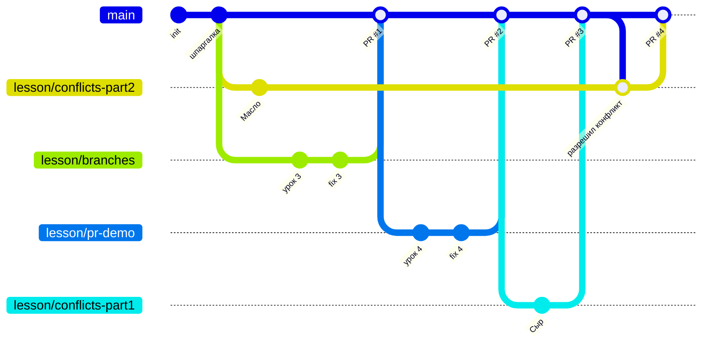

# Git на пальцах 🎓

Учебный репозиторий. Кода здесь нет, только простые `.md` файлы.
Главное здесь — **история**: как появлялись коммиты, ветки, pull request'ы и мержи.
Всё, о чём рассказывают уроки, в этом репозитории делалось по-настоящему, и это можно посмотреть.

## С чего начать

1. Читай уроки по порядку, это папка [`lessons/`](lessons/).
2. После каждого урока смотри, как то же самое выглядело «вживую» (таблица ниже).
3. Потом переходи к упражнениям в [PRAKTIKA.md](PRAKTIKA.md).
4. Если забыл команду, открывай [cheatsheet.md](cheatsheet.md).

## Уроки и где их увидеть вживую

| # | Урок | Где посмотреть |
|---|------|----------------|
| 1 | [Что такое git и коммит](lessons/01-osnovy.md) | первые коммиты в `main`: вкладка **Commits** |
| 2 | [.gitignore](lessons/02-gitignore.md) | файл [`.gitignore`](.gitignore) |
| 3 | [Ветки](lessons/03-vetki.md) | [PR #1](../../pull/1): ветка с 2 коммитами влита в `main` |
| 4 | [Push и Pull Request](lessons/04-pull-request.md) | [PR #2](../../pull/2): доработка после ревью — просто ещё один коммит |
| 5 | [Конфликты](lessons/05-konflikty.md) | [PR #3](../../pull/3) влит без проблем, в [PR #4](../../pull/4) был конфликт в [`pokupki.md`](pokupki.md) (см. комментарий в PR) |
| 🎯 | **Задание для тебя** | открытый PR во вкладке **Pull requests**: сделай ревью и смержи сам |

## Как выглядит история

Локально выполни:

```bash
git log --oneline --graph --all
```

Упрощённо история выглядит так:



Как это читать:
- **PR #1–#3**: ветка отделилась от `main`, в ней появились коммиты, потом её влили обратно.
- **Ветка `conflicts-part2`** отделилась рано, ещё до «Сыра». Когда в `main` уже был «Сыр», а в ветке «Масло», получился конфликт.
  Чтобы его разрешить, в ветку влили `main` (коммит «разрешил конфликт»), руками починили файл, и после этого PR #4 смержился.
