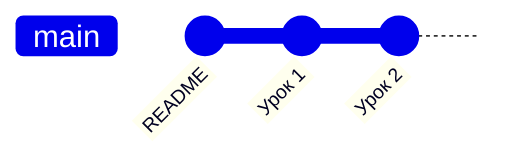

# Урок 1. Что такое git и коммит

**Git** — это «машина времени» для папки с файлами. Он запоминает снимки
состояния папки, и к любому снимку можно вернуться.

**Коммит** — один такой снимок + подпись «что поменял и зачем».

## Три места, где живут изменения

```
 Рабочая папка  ──git add──►  Staging (индекс)  ──git commit──►  История (репозиторий)
 (ты правишь)                 (что пойдёт в коммит)              (снимки навсегда)
```

- **Рабочая папка** — обычные файлы, которые ты редактируешь.
- **Staging** — «корзина покупок»: сюда кладёшь то, что хочешь закоммитить.
- **История** — сохранённые коммиты.

## Попробуй

```bash
git status                  # что изменилось?
git add lessons/01-osnovy.md  # положить файл в staging
git commit -m "Добавил урок 1"  # сделать снимок
git log --oneline           # посмотреть историю
```

## Как это выглядит



Каждый кружок — коммит. Они выстраиваются в цепочку: каждый знает своего «родителя».

> 💡 Хороший коммит — маленький и с понятным сообщением.
> «Добавил урок про ветки» — хорошо. «fix» / «asdasd» — плохо.

---

## 🛠 Сделай сам

**Зачем:** за день ты правишь кучу файлов, а коммиты должны быть «про одно»: «починил логин»
отдельно от «обновил README». Staging как раз позволяет разложить изменения по коммитам.

```bash
git switch -c trening-1

echo "Утро: кофе" > dnevnik.md
echo "купить хлеб" > zametki.md
git status                 # оба файла красные — git про них ещё не знает (untracked)

git add dnevnik.md
git status                 # dnevnik.md зелёный (в staging), zametki.md всё ещё красный

git commit -m "Дневник: утро"
git status                 # остался только zametki.md — в коммит он не попал

echo "Обед: суп" >> dnevnik.md
git diff                   # видно "+Обед: суп" — изменение ещё НЕ в staging
git add dnevnik.md
git diff                   # пусто! git diff показывает только то, что НЕ в staging
git diff --staged          # а вот тут видно — это то, что пойдёт в коммит
git commit -m "Дневник: обед"

git log --oneline -3
```

✅ **Проверь себя:**
- `git log --oneline -2` показывает два коммита: «Дневник: обед» и «Дневник: утро».
- `git status` показывает `zametki.md` как untracked: мы его так и не закоммитили.
- Ответь себе: чем `git diff` отличается от `git diff --staged`?

**Уборка.** Сначала посмотри на неочевидное:

```bash
git switch main
ls zametki.md              # файл всё ещё тут! Неотслеживаемые файлы "ездят" с тобой между ветками
rm zametki.md
git branch -D trening-1
```
