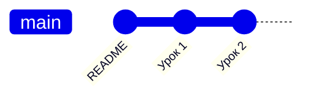

# Урок 1. Что такое git и коммит

**Git** — это «машина времени» для папки с файлами. Он запоминает снимки
состояния папки, и к любому снимку можно вернуться.

**Коммит** — один такой снимок + подпись «что поменял и зачем».

## Три места, где живут изменения

```
 Рабочая папка  ──git add──►  Staging (индекс)  ──git commit──►  История (репозиторий)
 (ты правишь)                 (что пойдёт в коммит)              (снимки навсегда)
```

- **Рабочая папка** — обычные файлы, которые ты редактируешь.
- **Staging** — «корзина покупок»: сюда кладёшь то, что хочешь закоммитить.
- **История** — сохранённые коммиты.

## Попробуй

```bash
git status                  # что изменилось?
git add lessons/01-osnovy.md  # положить файл в staging
git commit -m "Добавил урок 1"  # сделать снимок
git log --oneline           # посмотреть историю
```

## Как это выглядит



Каждый кружок — коммит. Они выстраиваются в цепочку: каждый знает своего «родителя».

> 💡 Хороший коммит — маленький и с понятным сообщением.
> «Добавил урок про ветки» — хорошо. «fix» / «asdasd» — плохо.
